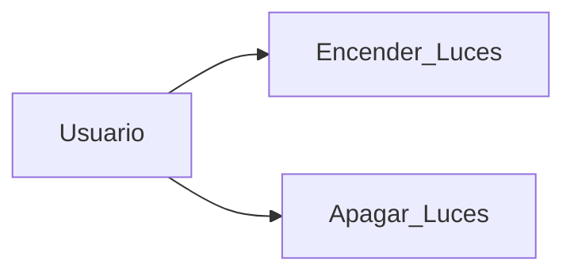
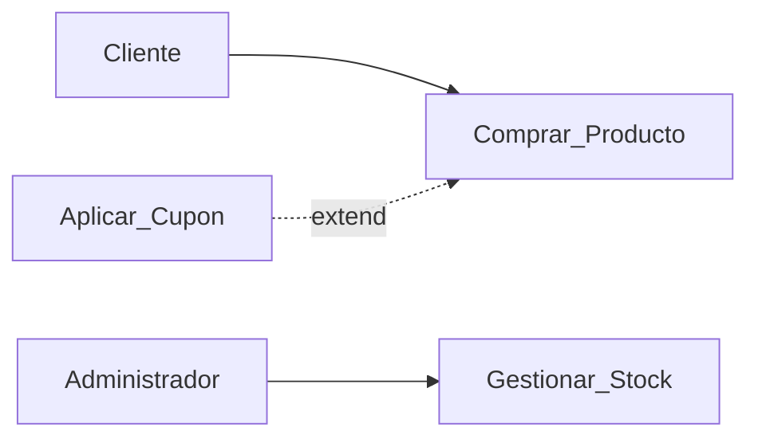
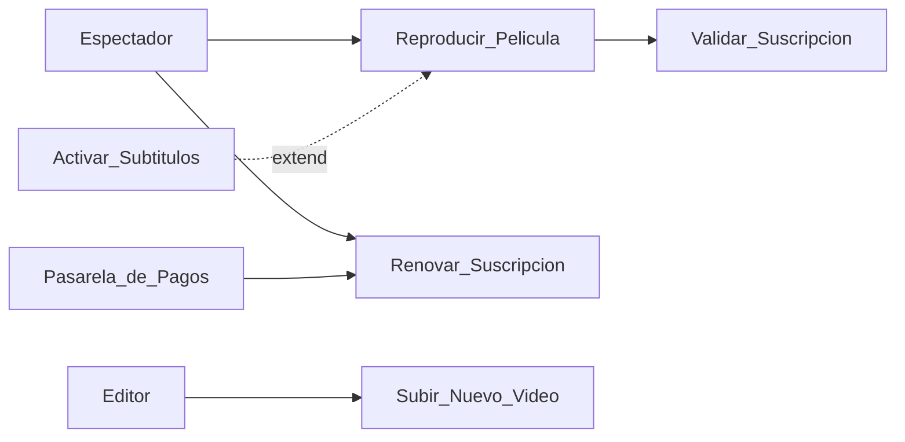

# Entornos 7.2 - Diagramas de Casos de Uso

## Ejercicio 1 - Sistema de Iluminación

```mermaid
graph LR
Usuario --> Encender_Luces
Usuario --> Apagar_Luces
```
## Ejercicio 2 - Tienda Online

```mermaid
graph LR
Cliente --> Comprar_Producto
Administrador --> Gestionar_Stock

Aplicar_Cupon -.->|extend| Comprar_Producto
```
## Ejercicio 3 - Plataforma Streaming

```mermaid
graph LR

Espectador --> Reproducir_Pelicula
Espectador --> Renovar_Suscripcion

Editor --> Subir_Nuevo_Video

Pasarela_de_Pagos --> Renovar_Suscripcion

Reproducir_Pelicula --> Validar_Suscripcion
Activar_Subtitulos -.->|extend| Reproducir_Pelicula
```
